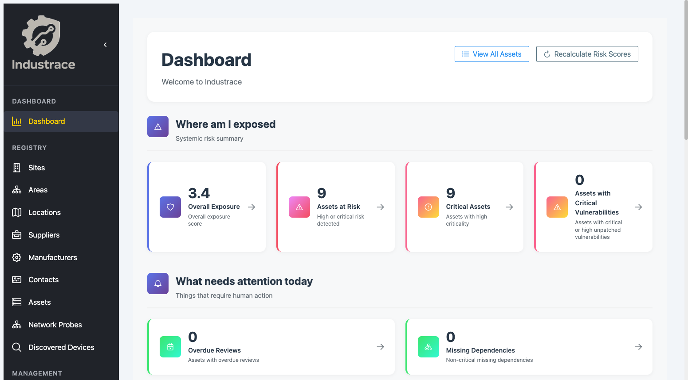
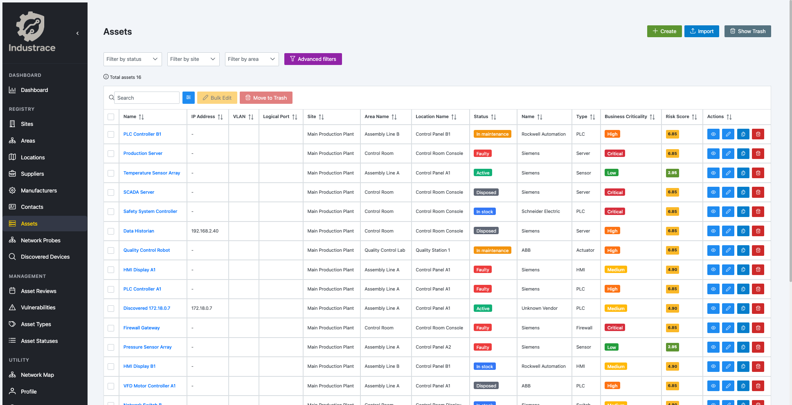

# Industrace - Industrial Asset Management System

[](https://opensource.org/licenses/AGPL-3.0)
[](https://github.com/industrace/industrace/releases/tag/v2.3.1)
[](#release-status)
[](https://www.docker.com/)
[](https://fastapi.tiangolo.com/)
[](https://vuejs.org/)

**Industrace** is an open-source Industrial Asset Management System for documenting, mapping, and assessing industrial equipment and networks. Built with FastAPI and Vue.js, it targets ICS environments — Purdue model mapping, ICS-specific risk parameters, and structured operational documentation.

Most asset management tools are designed for IT. Industrace was born from the observation that industrial operations need different logic. It is meant as a practical starting point: easy to deploy, preloaded with demo data, and open to real-world feedback and contributions.

## Release status

Industrace **2.3.1** adds bulk cleanup controls for discovered devices and improves Network Probe operational guidance for least-privilege deployments (systemd capabilities + Docker `cap_add`). The 2.x line remains **pilot recommended** — CSV import, deep health checks, IEC 62443 compliance, and Network Probes at *pilot-stable*. The codebase grew substantially between v1.x and v2.x; not every path is exercised in automated tests yet (CI runs backend tests with a coverage gate on critical modules).

We recommend a **controlled pilot** — internal network, limited users, non-critical ICS data — before relying on v2 in production OT environments. See the [Pilot Deployment Checklist](docs/PILOT_DEPLOYMENT_CHECKLIST.md). Your feedback via [GitHub Issues](https://github.com/industrace/industrace/issues) and real-world testing is how the project matures.

Industrace is **free to use** under AGPL-3.0. There is no paywall; community validation and contributions are what move it forward.

### Version lines

| Line | Status | For whom |
|------|--------|----------|
| **2.3.x** | Current — active development, MFA + pilot stability | Teams running controlled pilots on the 2.x line |
| **2.2.x** | Maintained — security fixes as needed | Teams on v2.2.0 |
| **2.1.x** | Maintained — security fixes as needed | Teams already deployed on 2.1.1 |
| **1.x** | **Frozen** — no new features (latest: [v1.1.0](https://github.com/Industrace/industrace/releases/tag/v1.1.0)) | Teams that prefer a smaller, stable base |

Moving from 1.x to 2.x is a **new installation**, not an in-place upgrade. See [MIGRATION.md](docs/MIGRATION.md).

## Built with human expertise and AI support

Industrace combines hands-on cybersecurity expertise with AI-assisted development. AI tools helped explore solutions and speed up coding and documentation; **human validation** — pilots, code review, issues, and contributions — is the next step. Born in Italy, the project pairs European attention to industrial processes with a global open-source mindset.

## 🌟 Key Features

- **Asset Management**: Complete lifecycle management of industrial assets, dependencies, and reviews
- **ISA/IEC 62443**: Security zones, conduits, compliance engine, and evidence (v2, optional per tenant) — see [scope & limits](docs/IEC62443.md)
- **Vulnerability Intelligence**: CVE management, feeds, and risk integration (v2)
- **Network Mapping**: Visual representation of asset connections and communications
- **Risk Assessment**: Built-in risk scoring, propagation, and vulnerability assessment
- **Multi-tenant Architecture**: Support for multiple organizations
- **Role-based Access Control**: Granular permissions (RBAC) with extended v2 permissions
- **Notifications**: Templates, queue, and user preferences (v2)
- **Single Sign-On**: Azure AD / Microsoft Entra ID (v2)
- **Change Management**: See what's changed with comparisons
- **Global Search**: Spotlight-style search (Command+K) across all entities with instant results
- **Asset Timeline**: Complete change history and audit trail for each asset
- **Document Management**: Asset documentation and photo management
- **Audit Trail**: Complete activity logging and change tracking
- **API-First Design**: RESTful API for integration with other systems
- **Modern UI**: Responsive Vue.js frontend with intuitive interface
- **Network Probes** *(v2, MVP)*: Passive discovery and device onboarding — see [probe docs](probe/NETWORK_PROBE.md)

Features marked *(v2)* are not available in the frozen 1.x line. Network Probes and some deployment modes (`make prod-cloud`, custom certs) are documented as **MVP/BETA** — validate in a lab before production OT networks.

## 📸 Screenshots & Demo

### 🏠 Dashboard Overview

*Main dashboard showing asset overview, risk scores, and system status*

### 📊 Asset Management

*Complete asset lifecycle management with detailed information and connections*

### 🌐 Network Topology

*Interactive network visualization showing asset connections and communications*

### 🔍 Asset Details

*Detailed asset view with interfaces, connections, and documentation*

### 👥 User Management

*Role-based access control with granular permissions management*

### 📋 Audit Trail

*Complete activity logging and change tracking for compliance*

### 🗺️ Floor Plan Integration

*Visual asset placement on floor plans with interactive mapping*

### 📱 Responsive Design

*Fully responsive interface that works on desktop, tablet, and mobile*

### 🔍 Global Search - Spotlight Feature

*Powerful spotlight-style global search (Command+K / Ctrl+K) that searches across all entities - assets, locations, sites, contacts, suppliers, and more. Real-time results with instant navigation to any item in your system.*

### 📜 Asset Timeline

*Complete change history and audit trail for each asset. Track every modification, view detailed change logs, and see who made what changes and when. Perfect for compliance, troubleshooting, and understanding asset evolution over time.*

## 🏗️ Architecture

- **Backend**: FastAPI with SQLAlchemy ORM
- **Database**: PostgreSQL 15+
- **Frontend**: Vue.js 3 with Vite
- **Authentication**: JWT-based with role-based access control
- **Containerization**: Docker and Docker Compose
- **API Documentation**: Auto-generated with OpenAPI/Swagger

## 🚀 Quick Start

**Quick Start?** Go to [Quick Start Guide](docs/QUICK_START.md) for a quick installation **in less than 5 minutes**.

### Prerequisites
- Docker and Docker Compose
- 4GB RAM minimum (8GB recommended)
- 20GB disk space minimum
- Port 80 and 443 available (for production)

### Installation

#### **Quick Start** (Recommended for first time)
```bash
# Clone the repository
git clone https://github.com/industrace/industrace.git
cd industrace

# Start production environment with demo data
make prod

# Access the application
open https://localhost
```

#### **Production Local** (HTTPS with Nginx + Self-signed certificates)
```bash
# Start production with Nginx + self-signed certificates
make prod

# Access the application
open https://localhost
# Note: You'll see a security warning due to self-signed certificates
# This is normal for local development. Click 'Advanced' and 'Proceed'
```

#### **Production Cloud** (BETA mode - HTTPS with Traefik + Let's Encrypt) 
```bash
# Start production with Traefik + Let's Encrypt
make prod-cloud

# Access the application
open https://industrace.local
```

#### **Custom Certificates** (BETA mode - HTTPS with Nginx)
```bash
# Setup custom certificates
make custom-certs-setup

# Start with custom certificates
make custom-certs-start

# Access the application
open https://yourdomain.com
```


### Development Environment (Advanced)
```bash
# Start development environment
docker-compose -f docker-compose.dev.yml up -d

# Add demo data to existing system
make demo

# Clean system completely
make clean

# Show available commands
make help

# Show configuration options
make config
```

### Default Credentials
- **Production Local URL**: https://localhost
- **Production Cloud URL**: https://industrace.local
- **Email**: admin@example.com
- **Password**: Admin@123456!

**Note**: Demo data is automatically populated when using `make prod` or `make prod-cloud`. The system includes sample sites, areas, locations, manufacturers, suppliers, contacts, assets with interfaces, and network connections for testing purposes. On first login you will be required to change your password; see [Password Policy](docs/ADMINISTRATION.md#password-policy).

## 📊 Demo Data Included

The system comes pre-populated with comprehensive demo data:

- **3 Sites**: Main Production Plant, Research & Development Center, Distribution Warehouse
- **12 Areas**: Assembly Lines, Quality Control Lab, Control Room, Maintenance Bay, etc.
- **19 Locations**: Control Panels, Quality Stations, Maintenance Bays, etc.
- **8 Assets**: PLCs, HMIs, Robots, Switches, Sensors, Servers with realistic specifications
- **10 Interfaces**: Network interfaces with IP addresses, MAC addresses, and protocols
- **5 Connections**: Network topology showing asset communications
- **4 Manufacturers**: Siemens, Rockwell Automation, Schneider Electric, ABB
- **4 Suppliers** and **6 Contacts**: Complete supply chain information

## Documentation

Full index: **[docs/README.md](docs/README.md)**.

| Guide | Description |
|-------|-------------|
| [Quick Start](docs/QUICK_START.md) | ~5 minutes to first login |
| [Installation](docs/INSTALLATION.md) | Docker prod/dev, custom certificates |
| [Configuration](docs/CONFIGURATION.md) | Environment and optional modules |
| [Pilot checklist](docs/PILOT_DEPLOYMENT_CHECKLIST.md) | Hardening before a controlled v2.1.x pilot |
| [Migration](docs/MIGRATION.md) | **v1 frozen** — v2 is a new install; upgrade within 2.x |
| [Administration](docs/ADMINISTRATION.md) | RBAC, SSO, password policy |
| [API](docs/API.md) | REST and external API |
| [IEC 62443](docs/IEC62443.md) | Scope when module is enabled |
| [Troubleshooting](docs/troubleshooting.md) | Common issues |
| [Release notes](docs/release-notes.md) | Version history |
| [Network Probe](probe/README.md) | Distributed discovery (separate docs) |

## 🔧 Development

### Prerequisites
- Python 3.8+
- Node.js 16+
- Docker and Docker Compose

### Setup Development Environment
```bash
# Clone and setup
git clone https://github.com/industrace/industrace.git
cd industrace

# Run tests
make test

# View logs
make logs
```

### Available Make Commands
```bash
make prod        # Start production (Nginx + self-signed certs + auto-init DB)
make prod-cloud   # Start production (Traefik + Let's Encrypt)
make demo        # Add demo data to existing system
make clean       # Clean system completely
make test        # Run tests
make logs        # View logs
make stop       # Stop all services
make build      # Build containers
make rebuild    # Rebuild containers
make status     # Show service status
make shell      # Open backend shell
make migrate    # Run database migrations
make reset-db   # Reset database
make backup     # Backup database, uploads, config
make backup-full # Full backup including logs
make restore    # Restore from backup (see docs/MIGRATION.md)
make restart    # Restart services
make info       # Show system information
make config     # Show configuration options
```

## 🤝 Contributing

We welcome contributions! Please see our [Contributing Guide](CONTRIBUTING.md) for details.

Especially valuable for v2.1.x right now:

- **Bug reports** — regressions, security concerns, unexpected behaviour in pilot deployments
- **Pilot feedback** — what worked and what did not (even anonymised summaries via issues help)
- **Tests and docs** — PRs that extend `make test` coverage or clarify deployment guides
- **Translations** — IT/EN strings and documentation improvements

## 📄 License

This project is licensed under the **GNU Affero General Public License v3.0 (AGPL-3.0)**. This means you are free to use, modify, and distribute the software, but any modifications must also be released under the same license.

See the [LICENSE](LICENSE) file for details.

## 🆘 Support

- **Documentation**: [docs/](docs/)
- **Issues**: [GitHub Issues](https://github.com/industrace/industrace/issues) — preferred channel for bugs and pilot feedback
- **Email**: industrace@besafe.it

## 📋 Changelog

See **[CHANGELOG.md](CHANGELOG.md)** and **[Release Notes](docs/release-notes.md)** for full version history.

### [v2.3.0] - July 22, 2026
- **MFA/TOTP**: two-factor auth for local users, backup codes, tenant policy, admin reset
- **Network Probes**: fix deleting probes with discovered devices
- **Upgrade**: run `alembic upgrade heads` after deploy (new MFA migration)
- See [CHANGELOG.md](CHANGELOG.md) for full details

### [v2.2.0] - July 15, 2026
- **Pilot stability**: CSV import for users/sites/locations; deep health checks (DB + Redis); Docker healthchecks
- **Network Probes**: statistics and matches API; operational [runbook](probe/RUNBOOK.md); docs at *pilot-stable*
- **IEC 62443**: SR-relevant asset filtering and technical characteristics in zone compliance
- **Assets**: real relation and critical vulnerability badge counts in asset detail
- See [CHANGELOG.md](CHANGELOG.md) for full details

### [v2.1.1] - June 29, 2026
- **Security hardening**: RBAC on core APIs, `SETUP_TOKEN` for production setup wizard, HttpOnly cookie auth (no `localStorage` JWT)
- **Documentation**: [IEC 62443 scope and limits](docs/IEC62443.md), [Pilot Deployment Checklist](docs/PILOT_DEPLOYMENT_CHECKLIST.md)
- **Production**: External API docs off by default; performance test router disabled in production
- Treat as **pilot-ready**, not certification-ready — see [Release status](#release-status)
- See [CHANGELOG.md](CHANGELOG.md) for full details

### [v2.1.0] - June 17, 2026
- **Network Probes**: Distributed passive discovery, discovered devices, onboard as asset — [probe docs](probe/README.md)
- **Syslog**: Per-tenant external audit log forwarding
- **IEC 62443**: RE-level assessments (RE 1–4), audit export CSV/JSON; optional module per tenant in Setup
- **SSO**: Login via HttpOnly cookie only (no JWT in URL); compliance dashboard aligned with SL-A engine
- See [CHANGELOG.md](CHANGELOG.md) and [release notes](docs/release-notes.md)

### [v2.0.0] - February 2026
- **ISA/IEC 62443**: Security zones, conduits, compliance engine, evidence — see [scope & limits](docs/IEC62443.md)
- **Vulnerability Intelligence**: CVE management, feeds, asset matching, risk integration
- **Asset Dependencies & Review**: Dependency graph, risk propagation, review scheduling
- **Notifications**: Templates, queue, logs, user preferences
- **Single Sign-On**: Azure AD / Microsoft Entra ID
- **Extended RBAC**: New permissions for zones, compliance, vulnerabilities, notifications, SSO
- **Password policy**: Stronger requirements; see [ADMINISTRATION.md](docs/ADMINISTRATION.md#password-policy)
- **Upgrade**: From v1.x install v2 fresh — [MIGRATION.md](docs/MIGRATION.md)

### [v1.1.0] - November 2025
- Trash management for Areas, multilingual printed kit, global search improvements, asset timeline filtering, performance indexes, translation restructuring. See [CHANGELOG.md](CHANGELOG.md).

### [v1.0.0] - August 2025
- Initial release: asset management, multi-tenant, RBAC, network topology, risk assessment, documents, audit trail, import/export, print, floor plans, i18n, REST API, Docker. See [CHANGELOG.md](CHANGELOG.md).

## 🗺️ Roadmap

See our [Roadmap](docs/roadmap.md) for planned features and improvements.

## Author and Support

- **Author**: Maurizio Bertaboni
- **Patronage**: The project is supported by BeSafe S.r.l.
- **Industrace Site**: https://besafe.it/industrace
- **Contact**: industrace@besafe.it
