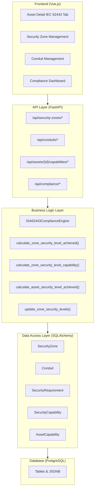
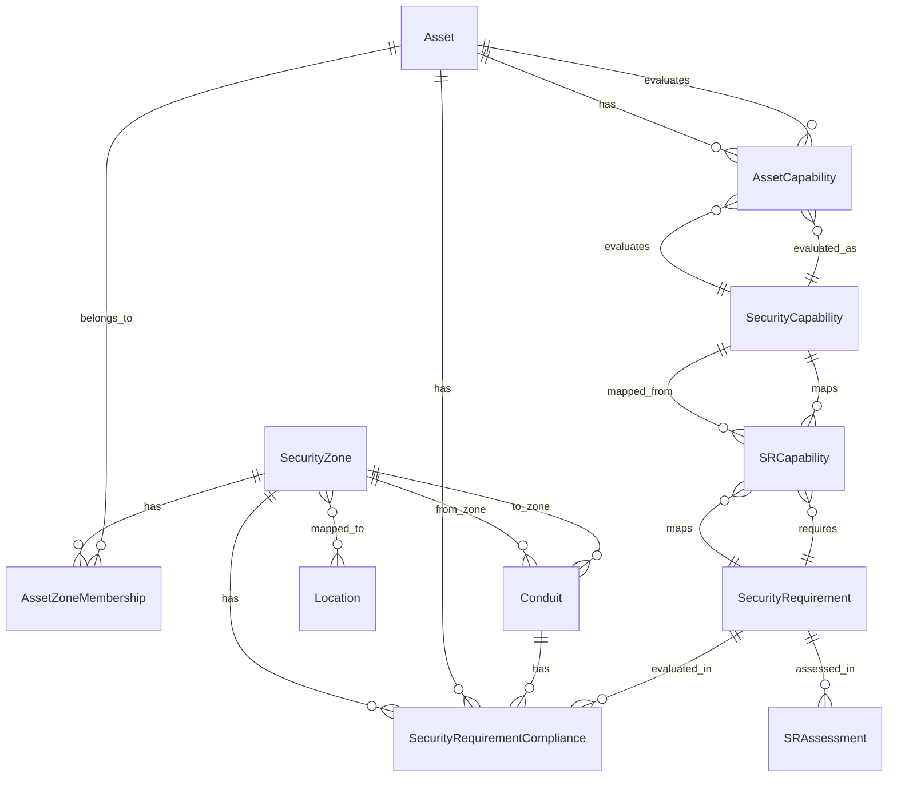
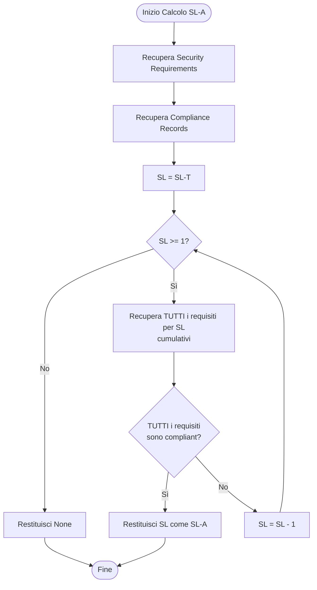

# ISA/IEC 62443 Implementation Recap

**Data Documento**: 23 Dicembre 2025  
**Versione**: 1.0  
**Stato**: Implementazione Completa

---

## Indice

1. [Panoramica](#panoramica)
2. [Architettura del Sistema](#architettura-del-sistema)
3. [Modelli di Dati](#modelli-di-dati)
4. [Logica di Business e Calcoli](#logica-di-business-e-calcoli)
5. [API Endpoints](#api-endpoints)
6. [Interfaccia Utente](#interfaccia-utente)
7. [Conformità alla Norma](#conformità-alla-norma)
8. [Correzioni e Miglioramenti Recenti](#correzioni-e-miglioramenti-recenti)
9. [Esempi d'Uso](#esempi-duso)
10. [Note Tecniche](#note-tecniche)

---

## Panoramica

Il sistema ISA/IEC 62443 in Industrace implementa un framework completo per la gestione della conformità alla norma internazionale ISA/IEC 62443, che definisce standard di sicurezza per i sistemi di controllo industriale (ICS).

### Obiettivi Principali

- **Gestione Security Zones**: Definizione e gestione di zone di sicurezza logiche
- **Gestione Conduits**: Comunicazioni tra zone con controlli di sicurezza
- **Security Requirements**: Tracciamento e valutazione dei requisiti di sicurezza
- **Security Capabilities**: Valutazione delle capacità di sicurezza degli asset
- **Calcolo Security Levels**: Calcolo automatico di SL-T, SL-A e SL-C
- **Compliance Assessment**: Valutazione della conformità ai requisiti

### Principi di Design

1. **Capability-Based Architecture**: Il sistema si basa su Security Capabilities che possono essere valutate su asset, zone e conduits
2. **Multi-Tenancy**: Supporto completo per multi-tenancy con isolamento dei dati
3. **Audit Trail**: Tracciamento completo delle modifiche e valutazioni
4. **Inferenza Intelligente**: Sistema di inferenza delle capability basato su metadati degli asset
5. **Conformità Normativa**: Calcoli conformi alla norma ISA/IEC 62443

---

## Architettura del Sistema

### Stack Tecnologico

- **Backend**: FastAPI (Python 3.11+)
- **Database**: PostgreSQL con supporto JSONB
- **ORM**: SQLAlchemy
- **Frontend**: Vue.js 3 + PrimeVue
- **Autenticazione**: JWT

### Componenti Principali



---

## Modelli di Dati

### Entità Principali

#### 1. SecurityZone

**Tabella**: `security_zones`

Rappresenta una zona di sicurezza logica (non fisica) secondo ISA/IEC 62443.

**Campi Principali**:
- `security_level_target` (SL-T): Livello di sicurezza target (1-4)
- `security_level_achieved` (SL-A): Livello di sicurezza raggiunto (1-4)
- `security_level_capability` (SL-C): Livello di sicurezza basato su capability (1-4)
- `compliance_status`: Stato di conformità ('compliant', 'non_compliant', 'partial', 'not_assessed')
- `zone_type`: Tipo di zona ('process', 'safety', 'control', 'enterprise', etc.)
- `is_dmz`: Flag per zone DMZ
- `is_air_gapped`: Flag per zone air-gapped

**Relazioni**:
- `asset_memberships`: Asset assegnati alla zona (many-to-many con ruoli)
- `conduits_from`: Conduits in uscita
- `conduits_to`: Conduits in entrata
- `compliance_records`: Record di conformità ai requisiti
- `locations`: Mappatura a location fisiche (many-to-many)

#### 2. Conduit

**Tabella**: `conduits`

Rappresenta un percorso di comunicazione tra Security Zones.

**Campi Principali**:
- `from_zone_id` / `to_zone_id`: Zone collegate
- `conduit_type`: Tipo ('network', 'serial', 'wireless', 'vpn', etc.)
- `is_encrypted`: Flag cifratura
- `encryption_type`: Tipo cifratura ('tls', 'ipsec', 'proprietary', etc.)
- `authentication_required`: Flag autenticazione
- `authentication_method`: Metodo ('certificate', 'psk', 'username_password', etc.)
- `security_level_target` / `security_level_achieved`: SL target e raggiunto
- `flow_justification`: Motivazione del flusso (principio "least privilege")

**Relazioni**:
- `from_zone` / `to_zone`: Zone collegate
- `compliance_records`: Record di conformità
- `conduit_assets`: Asset coinvolti nel conduit

#### 3. SecurityRequirement

**Tabella**: `security_requirements`

Requisiti di sicurezza dalla norma ISA/IEC 62443 (dati di riferimento, no tenant_id).

**Campi Principali**:
- `requirement_id`: Identificativo standard (es. "SR 1.1", "FR 1.1")
- `requirement_category`: Categoria ('SR', 'FR', 'CR')
- `title` / `description`: Titolo e descrizione
- `applies_to_zones` / `applies_to_conduits` / `applies_to_assets`: Applicabilità
- `min_security_level` / `max_security_level`: Range di SL applicabile (1-4)

**Relazioni**:
- `compliance_records`: Record di conformità per zone/conduits/assets
- `capability_mappings`: Mapping alle Security Capabilities richieste
- `assessments`: Valutazioni strutturate (SRAssessment)

#### 4. SecurityCapability

**Tabella**: `security_capabilities`

Capacità di sicurezza che possono essere richieste da un Security Requirement.

**Campi Principali**:
- `code`: Codice univoco (es. "firewall_enforcement", "authentication")
- `name`: Nome leggibile
- `category`: Categoria ('identity', 'boundary', 'monitoring', 'system_integrity', etc.)
- `applies_to_asset` / `applies_to_zone` / `applies_to_conduit`: Applicabilità
- `typical_roles`: Ruoli tipici (JSONB array, es. ["firewall", "router", "plc"])

**Relazioni**:
- `sr_mappings`: Mapping ai Security Requirements (SRCapability)
- `asset_capabilities`: Valutazioni su asset (AssetCapability)
- `assessment_evidence`: Evidenze nelle valutazioni

#### 5. AssetCapability

**Tabella**: `asset_capabilities`

Valutazione esplicita di una Security Capability su un Asset (tenant-specific).

**Campi Principali**:
- `asset_id` / `capability_id`: Riferimenti
- `support_level`: Livello di supporto ('supported', 'not_supported', 'unknown')
- `notes`: Note di valutazione
- `evidence_ref`: Riferimento a documentazione/evidenza

**Relazioni**:
- `asset`: Asset valutato
- `capability`: Security Capability valutata

#### 6. SRCapability

**Tabella**: `sr_capabilities`

Mapping tra Security Requirements e Security Capabilities richieste.

**Campi Principali**:
- `sr_id` / `capability_id`: Riferimenti
- `importance`: Livello di importanza ('primary', 'supporting')

#### 7. SecurityRequirementCompliance

**Tabella**: `security_requirement_compliance`

Record di conformità di un Security Requirement per una Zone, Conduit o Asset.

**Campi Principali**:
- `requirement_id`: Riferimento al Security Requirement
- `zone_id` / `conduit_id` / `asset_id`: Entità valutata (uno di questi)
- `compliance_status`: Stato ('compliant', 'non_compliant', 'partial', 'not_applicable', 'not_assessed')
- `compliance_percentage`: Percentuale di conformità (0-100, per partial)
- `assessed_by` / `assessment_date`: Chi e quando ha valutato
- `assessment_notes`: Note di valutazione
- `evidence_documents`: Riferimenti a documenti (JSONB)
- `remediation_required` / `remediation_plan` / `remediation_deadline`: Dati di remediation

#### 8. AssetZoneMembership

**Tabella**: `asset_zone_memberships`

Associazione many-to-many tra Asset e Security Zones con ruoli specifici.

**Campi Principali**:
- `asset_id` / `security_zone_id`: Riferimenti
- `role`: Ruolo dell'asset nella zona ('endpoint', 'gateway', 'monitoring', etc.)
- `interface_scope`: Scope delle interfacce coinvolte
- `sl_target`: SL-T specifico per questa membership (override)

### Diagramma Relazioni



---

## Logica di Business e Calcoli

### ISA62443ComplianceEngine

Il servizio principale per i calcoli di conformità si trova in `backend/app/services/isa62443_compliance_engine.py`.

#### 1. Calcolo SL-A (Security Level Achieved)

**Metodo**: `calculate_zone_security_level_achieved()`

**Logica Conforme alla Norma**:
- SL-A è il **più alto SL dove TUTTI i requisiti per quel SL sono compliant**
- I requisiti sono **cumulativi**: SL-2 include tutti i requisiti SL-1, SL-3 include SL-1+SL-2, etc.
- **Nessun requisito può essere "partial" o "non_compliant"** per raggiungere un SL
- Se un requisito non è valutato, è considerato non compliant

**Algoritmo**:
1. Recupera tutti i Security Requirements applicabili alle zone
2. Recupera i record di conformità per la zona
3. Per ogni SL da SL-T a 1 (inverso):
   - Raccoglie TUTTI i requisiti per quel SL (cumulativi)
   - Verifica che TUTTI siano compliant
   - Se sì, quello è lo SL-A
4. Restituisce il più alto SL raggiunto

**Esempio**:
- SL-T = 3
- SL-1: 5 requisiti, tutti compliant → SL-A ≥ 1
- SL-2: 8 requisiti (include SL-1), 7 compliant, 1 non_compliant → SL-A = 1
- SL-3: 12 requisiti (include SL-1+SL-2), tutti compliant → SL-A = 3

**Diagramma Flusso**:



#### 2. Calcolo SL-C (Security Level Capability)

**Metodo**: `calculate_zone_security_level_capability()`

**Logica**:
- SL-C rappresenta la **capacità massima del sistema** basata sulle Security Capabilities disponibili
- Per ogni SL, verifica se tutte le Security Capabilities richieste sono disponibili
- SL-C = più alto SL dove tutte le capability richieste sono disponibili

**Algoritmo**:
1. Recupera tutti gli asset nella zona (via AssetZoneMembership)
2. Recupera tutte le AssetCapability esplicite con `support_level = 'supported'`
3. Per ogni SL da SL-T a 1 (inverso):
   - Raccoglie tutti i Security Requirements per quel SL (cumulativi)
   - Recupera tutte le Security Capabilities richieste (via SRCapability)
   - Verifica che tutte le capability richieste siano disponibili (esplicite)
   - Se sì, quello è lo SL-C
4. Restituisce il più alto SL raggiungibile

**Note**:
- Attualmente considera solo capability esplicite (`support_level = 'supported'`)
- Le capability inferite potrebbero essere considerate in futuro con alta confidence (≥0.7)

#### 3. Validazione SL-A ≤ SL-C ≤ SL-T

**Metodo**: `update_zone_security_levels()`

**Logica**:
- Calcola SL-C
- Calcola SL-A
- **Valida**: SL-A ≤ SL-C ≤ SL-T
- Se SL-A > SL-C, cappa SL-A = SL-C (non può superare la capacità)
- Se SL-C > SL-T, cappa SL-C = SL-T

#### 4. Calcolo SL-A per Asset

**Metodo**: `calculate_asset_security_level_achieved()`

**Logica**:
1. Se l'asset ha un SL-A esplicito, lo usa
2. Se l'asset ha zone memberships:
   - Calcola SL-A per ogni zona
   - Usa il **minimo** (worst case) - l'asset è sicuro quanto la zona più debole
3. Se l'asset è in una zona (deprecated `security_zone_id`), usa lo SL-A della zona
4. Altrimenti, calcola basandosi sui record di conformità dell'asset (stessa logica delle zone)

#### 5. Calcolo SL-A per Conduit

**Metodo**: `calculate_conduit_security_level_achieved()`

**Logica**:
1. Calcola SL-A basato su proprietà di sicurezza:
   - Cifratura: +1 SL (base), +2 se TLS/IPSec
   - Autenticazione: +1 SL (base), +2 se certificati
2. Verifica record di conformità:
   - Se tutti i requisiti sono compliant, usa SL-T
   - Altrimenti, riduce proporzionalmente
3. Restituisce il minimo tra SL calcolato e SL-T

#### 6. Inferenza Capability

**Metodo**: `calculate_capability_inference_confidence()` (in `asset_capabilities.py`)

**Logica**:
Calcola un confidence score (0.0-1.0) per inferire capability da metadati asset:

- **Asset type match**: +0.2 (base)
- **Manufacturer match**: +0.3
- **Model match**: +0.3
- **Firmware match**: +0.1

**Soglie**:
- Confidence ≥ 0.2: Capability inferita (low/medium/high)
- Confidence ≥ 0.7: Considerata "verified" (alta confidence)
- Confidence < 0.2: Non inferita (available)

**Esempio**:
- Asset: PLC Siemens S7-1500, firmware v2.1
- Capability: "plc_control" con `typical_roles = ["plc", "controller"]`
- Match: asset_type="PLC" (+0.2), manufacturer="Siemens" (no match), model="S7-1500" (no match), firmware presente (+0.1)
- Confidence: 0.3 (medium)

---

## API Endpoints

### Security Zones

**Base Path**: `/api/security-zones`

- `GET /api/security-zones`: Lista zone
- `GET /api/security-zones/{zone_id}`: Dettaglio zona
- `POST /api/security-zones`: Crea zona
- `PUT /api/security-zones/{zone_id}`: Aggiorna zona
- `DELETE /api/security-zones/{zone_id}`: Elimina zona
- `GET /api/security-zones/{zone_id}/assets`: Asset nella zona
- `GET /api/security-zones/{zone_id}/compliance`: Stato compliance
- `POST /api/security-zones/{zone_id}/calculate-sl`: Ricalcola SL-A, SL-C
- `GET /api/security-zones/{zone_id}/risk`: Analisi rischio
- `POST /api/security-zones/{zone_id}/memberships`: Aggiungi membership
- `GET /api/security-zones/{zone_id}/memberships`: Lista memberships
- `PUT /api/security-zones/{zone_id}/memberships/{membership_id}`: Aggiorna membership
- `DELETE /api/security-zones/{zone_id}/memberships/{membership_id}`: Rimuovi membership

### Conduits

**Base Path**: `/api/conduits`

- `GET /api/conduits`: Lista conduits
- `GET /api/conduits/{conduit_id}`: Dettaglio conduit
- `POST /api/conduits`: Crea conduit
- `PUT /api/conduits/{conduit_id}`: Aggiorna conduit
- `DELETE /api/conduits/{conduit_id}`: Elimina conduit
- `POST /api/conduits/{conduit_id}/calculate-sl`: Ricalcola SL-A

### Asset Capabilities

**Base Path**: `/api/assets/{asset_id}/capabilities`

- `GET /api/assets/{asset_id}/capabilities`: Lista capability (esplicite, inferite, available)
- `POST /api/assets/{asset_id}/capabilities`: Crea capability esplicita
- `PUT /api/assets/{asset_id}/capabilities/{capability_id}`: Aggiorna capability
- `DELETE /api/assets/{asset_id}/capabilities/{capability_id}`: Elimina capability
- `POST /api/assets/{asset_id}/capabilities/bulk`: Aggiornamento bulk

**Response Model**: `AssetCapabilityResponse`
- Include `inference_confidence` per capability inferite
- Include `source`: 'explicit', 'inferred', 'available'

### Compliance

**Base Path**: `/api/compliance`

- `GET /api/compliance/zone/{zone_id}`: Dashboard compliance zona
- `GET /api/compliance/zone/{zone_id}/foundation-requirements`: Foundation Requirements
- `GET /api/compliance/zone/{zone_id}/security-requirements/{fr_id}`: Security Requirements per FR
- `GET /api/compliance/zone/{zone_id}/sr/{sr_id}/assets`: Asset per SR
- `GET /api/compliance/zone/{zone_id}/sr/{sr_id}/conduits`: Conduits per SR
- `GET /api/compliance/zone/{zone_id}/sr/{sr_id}/assessment-assist`: Assistenza valutazione
- `POST /api/compliance/zone/{zone_id}/sr/{sr_id}/assessment`: Crea/aggiorna valutazione

---

## Interfaccia Utente

### Asset Detail - IEC 62443 Tab

**File**: `frontend/src/components/features/assets/tabs/AssetDetailIEC62443Tab.vue`

**Sezioni**:

1. **Compliance Overview**
   - SL-T (Security Level Target)
   - SL-A (Security Level Achieved)
   - Compliance Status
   - Gap Analysis

2. **Zone Memberships**
   - Lista zone a cui l'asset appartiene
   - Ruolo dell'asset in ogni zona
   - SL-T specifico per membership
   - Aggiungi/Rimuovi membership

3. **Compliance Records**
   - Tabella record di conformità
   - Filtri per status, categoria
   - Dettagli valutazione

4. **Security Capabilities**
   - Tabella capability (esplicite, inferite, available)
   - Colonne:
     - Checkbox (selezione multipla)
     - Code, Name, Category
     - Support Level (supported/not_supported/unknown/available)
     - Source (explicit/inferred/available)
     - **Inference Confidence** (solo per inferred, con badge colorato)
     - Notes, Evidence Ref
     - Actions (Edit/Delete per explicit)
   - Filtri: Support Level, Category, Source
   - Toolbar:
     - "Add Capability" (crea capability esplicita)
     - "Bulk Update" (aggiorna multiple capability selezionate)
   - Dialogs:
     - Add/Edit Capability Dialog
     - Bulk Update Capability Dialog

**Visualizzazione Confidence**:
- **High** (≥0.7): Badge verde "Alta"
- **Medium** (0.4-0.69): Badge giallo "Media"
- **Low** (0.2-0.39): Badge rosso "Bassa"
- Mostra anche percentuale (es. "70%")

### Security Zone Management

**File**: `frontend/src/pages/SecurityZones.vue` (presumibilmente)

- Lista zone con filtri
- Creazione/Modifica zona
- Dashboard compliance per zona
- Gestione memberships

### Conduit Management

**File**: `frontend/src/pages/Conduits.vue` (presumibilmente)

- Lista conduits
- Creazione/Modifica conduit
- Configurazione sicurezza (cifratura, autenticazione)

---

## Conformità alla Norma

### Conformità Formale

Il sistema implementa i seguenti concetti chiave della norma ISA/IEC 62443:

1. **Security Zones**: Zone di sicurezza logiche (non fisiche)
2. **Conduits**: Percorsi di comunicazione tra zone
3. **Security Requirements**: Requisiti di sicurezza dalla norma
4. **Security Levels (SL)**: Livelli 1-4 con calcolo conforme
5. **Security Capabilities**: Capacità di sicurezza valutabili

### Calcolo SL-A Conforme

**Conformità Raggiunta** (dopo correzioni recenti):
- ✅ SL-A richiede **TUTTI i requisiti compliant** (non percentuale)
- ✅ Requisiti cumulativi gestiti correttamente (SL-2 include SL-1)
- ✅ Nessun requisito "partial" o "non_compliant" per raggiungere un SL

**Prima delle correzioni**:
- ❌ Usava soglia percentuale (80%)
- ❌ Non gestiva correttamente requisiti cumulativi

### Calcolo SL-C

**Implementazione**:
- ✅ Calcolo basato su Security Capabilities disponibili
- ✅ Validazione SL-A ≤ SL-C ≤ SL-T
- ✅ Considera solo capability esplicite (per ora)

**Potenziamenti Futuri**:
- Considerare capability inferite con alta confidence (≥0.7) per SL-C
- Caching per performance

### Non Conformità Note

**SRAssessment vs SecurityRequirementCompliance**:
- Esistono due modelli per le valutazioni:
  - `SecurityRequirementCompliance`: Modello semplice, usato attualmente
  - `SRAssessment`: Modello strutturato più completo (non ancora integrato)
- **Raccomandazione**: Unificare in futuro usando SRAssessment

---

## Correzioni e Miglioramenti Recenti

### 2025-12-23: Correzione Calcolo SL-A

**Problema**:
- Il calcolo SL-A usava una soglia percentuale (80%) invece di richiedere tutti i requisiti compliant
- Non conforme alla norma ISA/IEC 62443

**Correzione**:
- Modificato `calculate_zone_security_level_achieved()` per richiedere TUTTI i requisiti compliant
- Gestiti correttamente requisiti cumulativi (SL-2 include SL-1, etc.)
- Applicata stessa logica a `calculate_asset_security_level_achieved()` e `calculate_conduit_security_level_achieved()`

**File Modificati**:
- `backend/app/services/isa62443_compliance_engine.py`

### 2025-12-23: Implementazione SL-C

**Problema**:
- Il campo `security_level_capability` esisteva ma non era calcolato/utilizzato

**Implementazione**:
- Aggiunto metodo `calculate_zone_security_level_capability()`
- Integrato in `update_zone_security_levels()`
- Aggiunta validazione SL-A ≤ SL-C ≤ SL-T

**File Modificati**:
- `backend/app/services/isa62443_compliance_engine.py`

### 2025-12-23: Miglioramento Inferenza Capability

**Problema**:
- L'inferenza da asset_type era troppo semplificata (solo string matching)

**Miglioramento**:
- Aggiunta funzione `calculate_capability_inference_confidence()` con confidence score (0.0-1.0)
- Considera: asset_type (+0.2), manufacturer (+0.3), model (+0.3), firmware (+0.1)
- Aggiunto campo `inference_confidence` in `AssetCapabilityResponse`
- UI mostra confidence con badge colorati (high/medium/low)

**File Modificati**:
- `backend/app/routers/asset_capabilities.py`
- `backend/app/schemas/asset_capability.py`
- `frontend/src/components/features/assets/tabs/AssetDetailIEC62443Tab.vue`
- `frontend/src/locales/it/isa62443.json`
- `frontend/src/locales/en/isa62443.json`

---

## Esempi d'Uso

### Esempio 1: Creazione Zone e Calcolo SL-A

```python
# 1. Crea Security Zone
zone = SecurityZone(
    name="Process Control Zone",
    security_level_target=3,
    tenant_id=tenant_id
)

# 2. Assegna Asset alla Zone
membership = AssetZoneMembership(
    asset_id=asset_id,
    security_zone_id=zone.id,
    role="endpoint",
    tenant_id=tenant_id
)

# 3. Valuta Requisiti
compliance = SecurityRequirementCompliance(
    zone_id=zone.id,
    requirement_id=requirement_id,
    compliance_status="compliant",
    tenant_id=tenant_id
)

# 4. Calcola SL-A e SL-C
zone = ISA62443ComplianceEngine.update_zone_security_levels(db, zone.id)
# zone.security_level_achieved = 3 (se tutti i requisiti SL-3 sono compliant)
# zone.security_level_capability = 3 (se tutte le capability sono disponibili)
```

### Esempio 2: Valutazione Capability su Asset

```python
# 1. Crea AssetCapability esplicita
capability = AssetCapability(
    asset_id=asset_id,
    capability_id=capability_id,
    support_level="supported",
    notes="Verificato tramite documentazione tecnica",
    evidence_ref="https://docs.example.com/firewall-config",
    tenant_id=tenant_id
)

# 2. Recupera tutte le capability (esplicite + inferite)
capabilities = api.get_asset_capabilities(asset_id)
# Include:
# - Explicit: support_level="supported", source="explicit"
# - Inferred: support_level="unknown", source="inferred", inference_confidence=0.65
# - Available: support_level="available", source="available"
```

### Esempio 3: Calcolo SL-C Basato su Capability

```python
# 1. Asset nella zona hanno capability esplicite
asset1_capabilities = [
    AssetCapability(capability_id=firewall_cap_id, support_level="supported"),
    AssetCapability(capability_id=auth_cap_id, support_level="supported"),
]

asset2_capabilities = [
    AssetCapability(capability_id=logging_cap_id, support_level="supported"),
]

# 2. Calcola SL-C per la zona
sl_c = ISA62443ComplianceEngine.calculate_zone_security_level_capability(db, zone)
# Verifica se tutte le capability richieste per SL-3 sono disponibili
# Se sì, SL-C = 3
```

---

## Note Tecniche

### Performance

**Considerazioni**:
- Il calcolo SL-A/SL-C può essere costoso per zone con molti requisiti e asset
- **Raccomandazione**: Implementare caching dei risultati
- Calcolo lazy: solo quando richiesto o quando cambiano i dati

**Ottimizzazioni Future**:
- Background job per ricalcolo periodico
- Cache Redis per risultati calcolati
- Indici database su `compliance_status`, `support_level`

### Multi-Tenancy

**Isolamento**:
- Tutti i modelli tenant-specific hanno `tenant_id`
- Filtri automatici in tutte le query
- Security Requirements e Capabilities sono system-wide (no tenant_id)

### Audit Trail

**Tracciamento**:
- `assessed_by` / `assessment_date` in `SecurityRequirementCompliance`
- `created_at` / `updated_at` in tutti i modelli
- Audit log per operazioni critiche (via `@audit_log_action`)

### Validazione Dati

**Constraint Database**:
- `security_level_target` / `security_level_achieved` / `security_level_capability`: 1-4
- `compliance_status`: enum valori validi
- `support_level`: enum valori validi
- Unique constraint su `(asset_id, capability_id)` in `AssetCapability`

### Migrazioni Database

**Alembic**:
- Tutte le modifiche schema via migrazioni Alembic
- Supporto per rollback
- Versioning completo

---

## Conclusioni

Il sistema ISA/IEC 62443 in Industrace è **completo e conforme alla norma** dopo le correzioni recenti. Implementa:

✅ Gestione completa di Security Zones, Conduits, Requirements  
✅ Calcolo corretto di SL-A, SL-C, SL-T  
✅ Sistema di Security Capabilities con inferenza intelligente  
✅ API RESTful complete  
✅ Interfaccia utente intuitiva  
✅ Multi-tenancy e audit trail  

**Prossimi Passi Consigliati**:
1. Unificare modelli di valutazione (SRAssessment vs SecurityRequirementCompliance)
2. Implementare caching per calcoli SL-A/SL-C
3. Considerare capability inferite con alta confidence per SL-C
4. Aggiungere test automatizzati per calcoli di conformità
5. Documentazione utente per workflow di compliance

---

**Documento creato il**: 23 Dicembre 2025  
**Ultima revisione**: 23 Dicembre 2025  
**Versione**: 1.0

