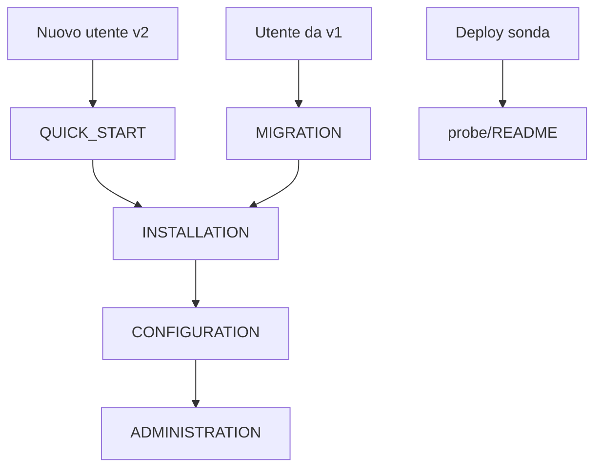

# Industrace documentation

**Industrace 2.x** is the current product line. **Industrace 1.x** (`v1.0.0`) is frozen — no new features. Moving from v1 to v2 is a **new installation**, not an in-place `git pull`. See [MIGRATION.md](MIGRATION.md).

Open-source CMDB for Industrial Control Systems. License: **AGPL-3.0**.

- **Author**: Maurizio Bertaboni — BeSafe S.r.l.
- **Website**: https://besafe.it/industrace
- **Contact**: industrace@besafe.it

---

## Recommended reading order



---

## User documentation (~10 guides)

| Guide | Description |
|-------|-------------|
| [QUICK_START.md](QUICK_START.md) | Run Industrace in ~5 minutes |
| [INSTALLATION.md](INSTALLATION.md) | Full install: Docker, prod, dev, custom certs |
| [PILOT_DEPLOYMENT_CHECKLIST.md](PILOT_DEPLOYMENT_CHECKLIST.md) | Hardening checklist for controlled production pilots |
| [CONFIGURATION.md](CONFIGURATION.md) | Environment variables and optional modules |
| [ADMINISTRATION.md](ADMINISTRATION.md) | RBAC, SSO (Azure AD), password policy |
| [MIGRATION.md](MIGRATION.md) | v1 frozen / v2 fresh install, upgrade 2.x, backup |
| [troubleshooting.md](troubleshooting.md) | Common issues |
| [API.md](API.md) | REST API and external integrations |
| [IEC62443.md](IEC62443.md) | ISA/IEC 62443 scope and limits (when enabled) |
| [risk-scoring.md](risk-scoring.md) | Asset risk score formula, thresholds, API and UI |
| [PRINT.md](PRINT.md) | Asset PDF and Printed Kit (ReportLab, server-side) |
| [release-notes.md](release-notes.md) | Version history |

---

## Network Probe (separate docs)

Passive network discovery is documented under **[probe/](../probe/README.md)** — not in this folder.

| Guide | Description |
|-------|-------------|
| [probe/README.md](../probe/README.md) | Overview and quick start |
| [probe/NETWORK_PROBE.md](../probe/NETWORK_PROBE.md) | Complete guide (deploy, API, architecture, troubleshooting) |

---

## Optional / other

| Document | Description |
|----------|-------------|
| [roadmap.md](roadmap.md) | Planned features |
| [archive/](archive/) | Internal checklists and superseded dev notes |

---

## Quick install

```bash
git clone https://github.com/industrace/industrace.git
cd industrace
make prod
open https://localhost
```

Default demo login: `admin@example.com` / `Admin@123456!` — change on first login ([ADMINISTRATION.md](ADMINISTRATION.md#password-policy)).

---

## Support

1. [troubleshooting.md](troubleshooting.md)
2. [API.md](API.md) and live docs at `/api/docs`
3. Logs: `make logs`
4. Health: `curl -k https://localhost/api/health`
5. Email: industrace@besafe.it

---

## Legacy paths

Older filenames (`UPGRADE.md`, `SSO_AZURE_AD_SETUP.md`, etc.) were removed or consolidated into the guides above.
