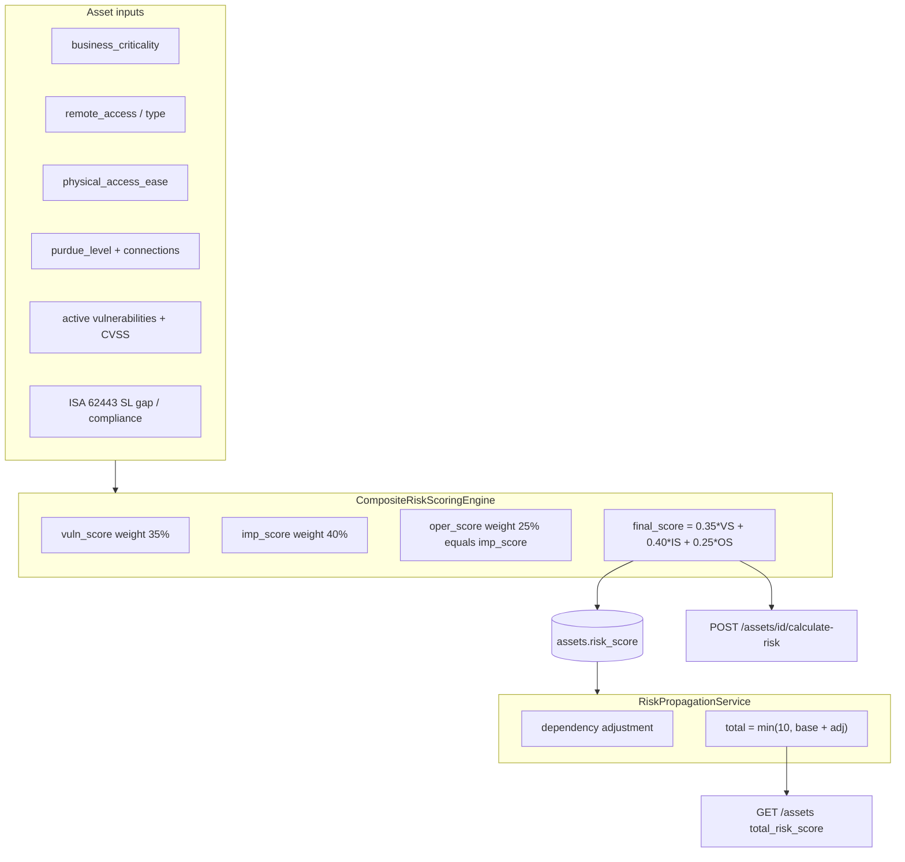

# Asset risk scoring

## At a glance

Every asset in Industrace receives a **risk score from 0 to 10**. The higher the number, the greater the risk.

### Two scores, one purpose

| What you see | What it means |
|--------------|---------------|
| **Base score** (`risk_score`) | Risk intrinsic to the asset: how exposed it is, how critical it is for the business, which vulnerabilities affect it. Saved in the database. |
| **Total score** (`total_risk_score`) | Base score **plus** an extra adjustment when the asset depends on other high-risk assets. Shown in lists and detail views; not saved separately. |

In most screens the **total score** is what matters for prioritisation. The base score is always available for comparison and in the Risk tab breakdown.

### How the base score is built

The engine combines three dimensions with fixed weights:

1. **Vulnerabilities & exposure (35%)** — remote access, ease of physical access, number of connections, active CVEs, ISA/IEC 62443 gaps (if enabled).
2. **Business impact (40%)** — operational criticality of the asset (`low` → `critical`). **Required**: without it, no score is calculated.
3. **Operational context (25%)** — today mirrors business impact; reserved for future differentiation.

The result is a single number between 0 and 10.

### Risk from dependencies

If asset A **depends on** asset B and B is risky, A’s **total score** goes up — but never above 10. Dependency type, criticality, and confidence all influence how much risk “flows” from one asset to another.

### Risk levels (labels)

Levels are derived from the score; they are not stored as separate fields.

| Score | Level | Typical meaning |
|-------|-------|-----------------|
| — | Undefined | Business criticality not set |
| 0 – 3.9 | Low | Acceptable residual risk |
| 4 – 6.9 | Medium | Worth monitoring and planning |
| 7 – 10 | High | Priority for review and mitigation |

In the UI, scores **≥ 8** can trigger a stronger **critical** alert on the asset detail banner (same backend level as high, more visible messaging).

### When scores are updated

- **Yes:** edit of risk-related fields, vulnerability status change, explicit recalculation (`calculate-risk` or batch).
- **No:** asset creation alone does not calculate risk automatically.

---

## Technical reference

`risk_level` is **not** stored in the database; it is derived from score thresholds at calculation or API response time.

| Field | Storage | Meaning |
|-------|---------|---------|
| `risk_score` | `assets.risk_score` (persisted) | Base composite score |
| `total_risk_score` | List API only | Base + dependency adjustment (cap 10) |

---

## Architecture



Implementation: [`backend/app/services/risk_scoring.py`](../backend/app/services/risk_scoring.py), [`backend/app/services/risk_propagation.py`](../backend/app/services/risk_propagation.py).

---

## Base score formula

### Weights

- Vulnerability: **35%**
- Impact: **40%**
- Operational: **25%** (currently identical to impact; reserved for future differentiation)

### Vulnerability partial score (`vuln_score`)

Starts at **1**, then additive penalties (clamped to 1–10 before weighting):

| Factor | Penalty |
|--------|---------|
| Remote access enabled | +2 |
| Remote access type `unattended` | +2 |
| Physical access `unrestricted` / `external` / legacy `easy` | +3 |
| Physical access `controlled` / `dmz` / legacy `medium` | +1 |
| Connections | +1 per 5 connections |
| Critical active vulnerabilities (`unreviewed` / `acknowledged`) | +3 |
| High active vulnerabilities | +2 |
| Max CVSS ≥ 9.0 | +2 |
| Max CVSS ≥ 7.0 | +1 |
| ISA 62443 SL gap (SL-T − SL-A) | +1.5 per level (tenant module) |
| ISA 62443 `non_compliant` | +2.0 |
| ISA 62443 `partial` | +1.0 |

**Not included in base score:** critical dependencies (handled separately), `exposure_level`, `impact_value`.

**Known gap:** Purdue cross-level connection penalty (+3) is defined but `_has_direct_high_level_connection()` is a placeholder and always returns `false`.

### Impact partial score (`imp_score`)

Requires **`business_criticality`** (mandatory):

| Criticality | Base impact score |
|-------------|-------------------|
| low | 2 |
| medium | 5 |
| high | 8 |
| critical | 10 |

Purdue level 0, 1, or 2 adds **+2** to impact.

If `business_criticality` is missing, `final_score` is `null` and suggestions ask to set it.

### Final base score

```
final_score = round(0.35 * vuln_score + 0.40 * imp_score + 0.25 * oper_score, 2)
final_score = clamp(final_score, 0, 10)
```

---

## Dependency propagation

When asset A depends on asset B, B's risk can increase A's **displayed** total score.

```
adjustment = dep_risk * criticality_weight * type_weight * confidence_weight * depth_decay
total_risk_score = min(10, base_risk + sum(adjustments))
```

| Dependency criticality | Weight |
|------------------------|--------|
| low | 0.25 |
| medium | 0.50 |
| high | 0.75 |
| critical | 1.0 |

| Dependency type | Weight |
|-----------------|--------|
| logical | 0.3 |
| functional | 0.5 |
| data_flow | 0.7 |
| control_flow | 0.9 |

| Confidence | Weight |
|------------|--------|
| low | 0.5 |
| medium | 0.75 |
| high | 1.0 |

Chain propagation uses depth decay: `1 / (1 + (depth - 1) * 0.2)`. Each adjustment is capped at 50% of the source asset risk.

Cache: 5-minute TTL, invalidated on dependency CRUD and bulk risk recalculation.

---

## Risk levels (thresholds)

Official backend thresholds (`calculate_asset_risk`):

| Score | `risk_level` | UI severity |
|-------|--------------|-------------|
| `null` | `undefined` | info |
| &lt; 4 | `low` | success |
| 4 – 6.99 | `medium` | warning |
| ≥ 7 | `high` | danger |

Other thresholds in the codebase:

- **≥ 5** — asset counted as "at risk" (dashboard exposure)
- **≥ 7** — high risk (external API, notifications)
- **≥ 8** — optional **critical alert** tier in the UI banner only (stronger messaging, same backend level as high)

Frontend labels are centralized in [`frontend/src/composables/useRiskLabels.js`](../frontend/src/composables/useRiskLabels.js).

---

## When scores are recalculated

| Event | Base `risk_score` | Notes |
|-------|-------------------|-------|
| Asset **create** | No | Explicit calculation or update required |
| Asset **update** (risk fields) | Yes | `business_criticality`, `physical_access_ease`, `remote_access`, `remote_access_type`, `purdue_level` |
| Vulnerability status change | Yes | When status changes on asset vulnerability |
| `POST /assets/{id}/calculate-risk` | Yes | Persists and returns breakdown |
| `POST /assets/recalculate-all-risk-scores` | Yes | Batch + cache invalidation |
| `GET /assets/risk-overview` | Yes | **Side effect:** recalculates all scores while returning stats |
| Dependency CRUD | No (base) | Invalidates cache; `total_risk_score` recomputed on list |

---

## API endpoints

| Method | Path | Purpose |
|--------|------|---------|
| POST | `/assets/{id}/calculate-risk` | Calculate, persist, return breakdown |
| POST | `/assets/recalculate-all-risk-scores` | Batch recalculation |
| GET | `/assets` | List with `risk_score` and `total_risk_score` |
| GET | `/assets/risk-overview` | Aggregate stats (recalculates) |
| GET | `/asset-dependencies/assets/{id}/risk-from-dependencies` | Dependency risk breakdown |
| GET | `/asset-dependencies/assets/{id}/risk-propagation` | Propagation chain |
| GET | `/dashboards/exposure` | Tenant exposure summary |

---

## UI surfaces

| Location | Shows |
|----------|-------|
| Assets list | `total_risk_score` (fallback `risk_score`); filters `risk_score_min` / `risk_score_max` apply to **base** score; sort uses `risk_score` |
| Asset detail — Risk tab | Breakdown from `calculate-risk`, dependencies, propagation |
| Asset detail — Overview banner | Total risk alert tiers |
| Network map | Node colours from base `risk_score` |
| Print / PDF | Score formatted as `X.XX / 10` |

---

## Related metrics (not asset base score)

| Metric | Scale | Service |
|--------|-------|---------|
| Per-CVE `risk_impact` | Variable | `VulnerabilityImpactCalculator` |
| Security zone risk | 0–100 | `ZoneRiskCalculator` |
| Tenant exposure | 0–10 | `ExposureCalculator` |

---

## Known limitations

1. `oper_score` duplicates `imp_score` — operational dimension not yet differentiated.
2. Purdue cross-level connection check not implemented.
3. Asset list sorts/filters on base `risk_score`, not `total_risk_score`.
4. `GET /assets/risk-overview` mutates data (recalculates on read).
5. Asset creation does not auto-calculate risk.
