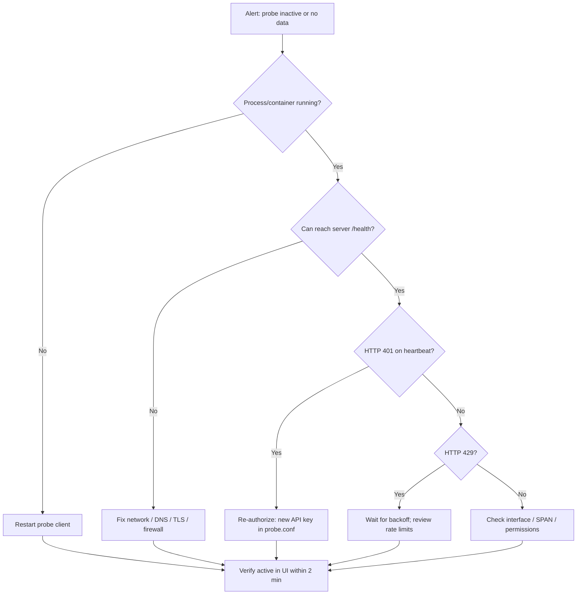

# Network Probe — Operational Runbook

Operational procedures for **Industrace Network Probes** in pilot deployments. For architecture, API reference, and configuration see [NETWORK_PROBE.md](NETWORK_PROBE.md).

**Audience:** platform operators, OT/IT admins running a pilot.

---

## 1. Health checklist (daily)

| Check | Where | Expected |
|-------|-------|----------|
| Probe status | UI → **Network Probes** | `active` |
| Last heartbeat | Probe detail / `GET /network-probes/{id}/status` | Within `heartbeat_interval + 60s` (default ~90s) |
| Last data received | Probe detail | Within `data_transmission_interval + margin` (default ~6 min) |
| Health score | Probe status API | ≥ 70 during normal operation |
| Discovered devices count | UI → **Discovered Devices** | Increases after first transmission cycle |
| Server health | `GET /api/health` | `200`, database reachable |

```bash
# Quick probe statistics (JWT required)
curl -s -H "Authorization: Bearer $TOKEN" \
  "$SERVER/api/network-probes/$PROBE_ID/statistics?time_range=24h" | jq .
```

---

## 2. Incident response flow



### Severity guide

| Severity | Condition | Action |
|----------|-----------|--------|
| **P1** | All probes inactive > 15 min during pilot | Restart clients; verify server; open incident |
| **P2** | Single probe inactive; others OK | Follow flow above; check site-specific mirror/SPAN |
| **P3** | Heartbeat OK but no new discoveries > 24h | Verify traffic on segment; review BPF filter / sampling |
| **P4** | Elevated error_rate in statistics | Inspect probe logs; check CPU/memory on probe host |

---

## 3. Common scenarios

### 3.1 Probe shows `inactive`

1. Confirm container/process: `docker ps` or `systemctl status industrace-probe`
2. Inspect logs: `docker logs network-probe` or `tail -f network_probe.log`
3. Validate `probe.conf`: `server_url`, `probe_id` (UUID), `api_key`
4. Test connectivity: `curl -v $SERVER/api/health`
5. If de-authorized: UI → deauthorize was triggered → copy new key from probe recreate flow or update config after admin rotation

**Stale threshold:** `PROBE_HEARTBEAT_STALE_SECONDS` (default 300). Backend marks inactive if no heartbeat in that window.

### 3.2 Client stopped after two HTTP 401

**Expected behavior (v2.1+).** The client stops after consecutive auth failures to avoid hammering the server.

1. Do **not** restart blindly with the old key
2. Admin: verify probe still exists; if de-authorized, distribute new API key
3. Update `probe.conf` → restart probe

### 3.3 No discovered devices

1. Probe must be `active` with recent `last_data_received`
2. Wait at least one `data_transmission_interval` (default 300s)
3. Confirm L2 visibility: SPAN/mirror/tap on correct VLAN/segment
4. On Linux: `ip link show`, promisc mode, and service capabilities (`CAP_NET_RAW`/`CAP_NET_ADMIN`)
5. Check rate limits: server logs for HTTP 429 on `/data-transmission`
6. Review `capture_filter` — overly restrictive BPF drops all traffic

### 3.4 High CPU on probe host

1. Lower `sampling_rate` (e.g. `0.1`)
2. Set `payload_analysis = false` (default)
3. Tighten BPF `capture_filter` to industrial ports only
4. Review statistics: `packets_per_second_avg`, `bytes_per_second_avg`

### 3.5 Duplicate or wrong asset matches

1. Use `GET /discovered-devices/{id}/matches` for full candidate list
2. Prefer MAC match over IP when assigning
3. Manually assign via `PUT /discovered-devices/{id}` with `matched_asset_id`
4. Ignore false positives: set status `ignored`

---

## 4. Log locations

| Component | Location |
|-----------|----------|
| Probe client (native) | `./network_probe.log` (10 MB × 5 rotations) |
| Probe client (Docker) | `docker logs <container>`; mount `/logs` if configured |
| Industrace backend | Container stdout / configured log path |
| Auth failures | Backend logs (API keys redacted via `log_sanitizer`) |

Useful log patterns:

```text
401 Unauthorized          → API key mismatch or de-authorize
429 Too Many Requests     → Rate limit; client should backoff
Connection refused        → server_url / firewall
Permission denied         → capture capabilities / interface
```

---

## 5. Key metrics (`GET /network-probes/{id}/statistics`)

| Field | Meaning |
|-------|---------|
| `total_packets` / `total_bytes` | Cumulative counters on probe record (best effort) |
| `unique_devices` | Distinct MACs seen by this probe |
| `active_connections` | Last reported connection count |
| `protocol_distribution` | Aggregated from transmissions in time window, else device protocols |
| `traffic_volume` | Estimated daily bytes from heartbeat `bytes_per_second` |
| `error_rate` | Heartbeat errors / count, or failed transmissions |
| `performance_metrics` | Averages: CPU, memory, disk, PPS, BPS, heartbeat/transmission counts |

**Time range query param:** `time_range=24h`, `7d`, `30d` (pattern: `\d+[hd]`).

---

## 6. Maintenance tasks

| Task | Frequency | Command / action |
|------|-----------|------------------|
| Review inactive probes | Weekly | UI overview |
| Purge old telemetry | Automatic | `PROBE_RETENTION_DAYS` (default 90) |
| Rotate API key after compromise | As needed | De-authorize → update `probe.conf` → restart |
| Update probe image | Per release | Rebuild `Dockerfile.probe`; rolling restart |
| Validate RBAC | After role changes | `make update-roles`; permission `network_probes` |

---

## 7. Pilot go-live verification

Before handing to pilot users:

- [ ] Probe created in UI; API key stored securely
- [ ] First heartbeat within 2 minutes of client start
- [ ] First data transmission within one interval
- [ ] At least one device in **Discovered Devices**
- [ ] Statistics endpoint returns data for the probe
- [ ] De-authorize test performed in staging (client stops cleanly)
- [ ] TLS verified (`ssl_verify = true` in production)

---

## 8. Escalation

1. Collect: probe ID, tenant, last heartbeat timestamp, last 50 lines of probe log, statistics JSON (`time_range=24h`)
2. Check server: `/api/health`, database connectivity, recent deploys
3. If capture-side: involve network team for SPAN/tap placement
4. File issue with reproduction steps and sanitized logs (no API keys)

---

## Related docs

- [NETWORK_PROBE.md](NETWORK_PROBE.md) — full guide
- [SYSTEMD_NATIVE_SETUP.md](SYSTEMD_NATIVE_SETUP.md) — native systemd deployment
- [PILOT_DEPLOYMENT_CHECKLIST.md](../docs/PILOT_DEPLOYMENT_CHECKLIST.md) — server pilot checklist
- [troubleshooting.md](../docs/troubleshooting.md) — general Industrace server issues
- [CONFIGURATION.md](../docs/CONFIGURATION.md) — `PROBE_*` environment variables

---

*Runbook version: 1.0 — pilot-stable (July 2026)*
